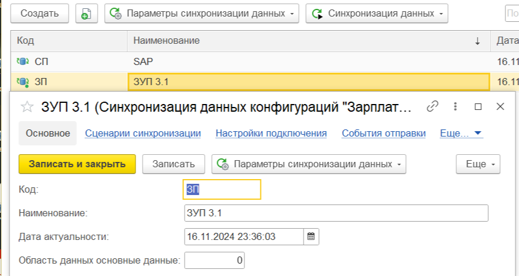
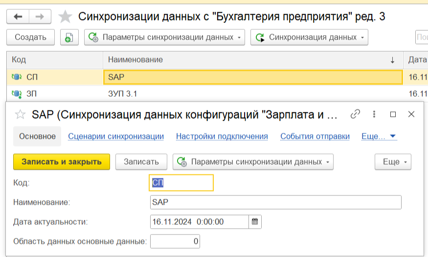
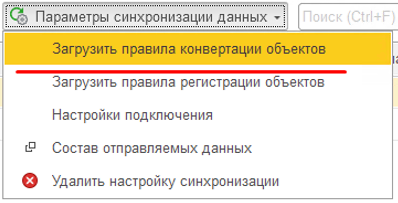
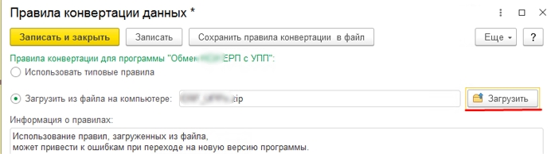
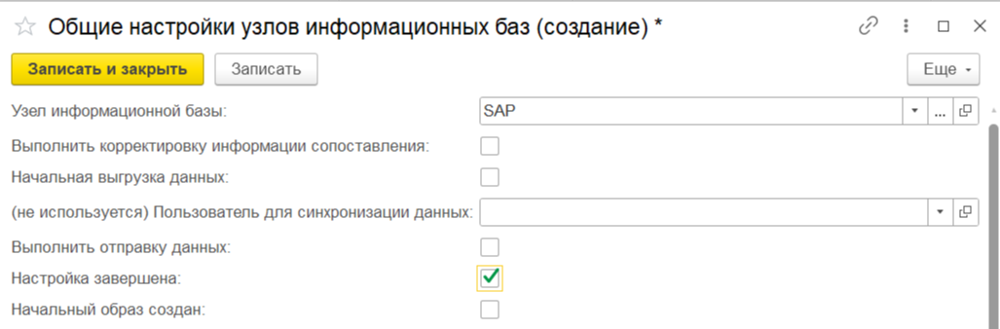
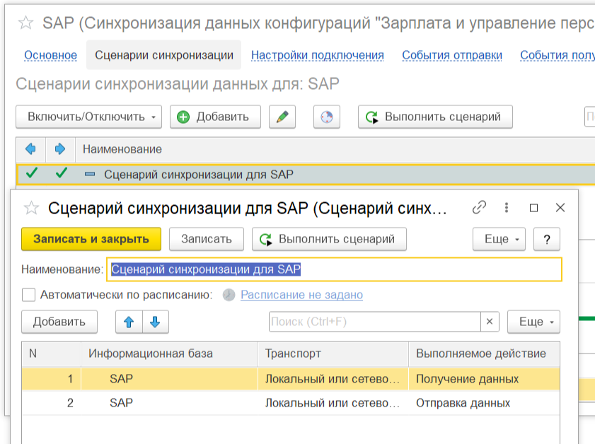

# Добавить свой план обмена в типовую конфигурацию

## Конфигурирование нового плана обмена в конфигураторе
### 1. Создаем свой план обмена
1. Создаем план обмена условно "ОбменЗарплата3SAP"
2. Добавляем на него пара доступа
В случае с ЗУП 3.1. это роли 
   - БазовыеПрава БЗК (расширенная). Чтение, Просмотр, Ввод по строке
   - ПолныеПрава. Все, кроме интерактивного удаления
3. Определяем состав плана обмена и способ регистрации изменений. Обязательно включаем в состав регистр сведений - **СоответствияОбъектовИнформационныхБаз**

### 2. Включаем в общие команды
```
ОбщаяКоманда.ЗагрузитьПравилаКонвертацииОбъектов.ТипПараметраКоманды
ОбщаяКоманда.ЗагрузитьПравилаРегистрацииОбъектов.ТипПараметраКоманды
ОбщаяКоманда.НастройкиПодключения.ТипПараметраКоманды
ОбщаяКоманда.Синхронизировать.ТипПараметраКоманды
ОбщаяКоманда.СобытияОтправки.ТипПараметраКоманды
ОбщаяКоманда.СобытияПолучения.ТипПараметраКоманды
ОбщаяКоманда.СоставОтправляемыхДанных.ТипПараметраКоманды
ОбщаяКоманда.СценарииСинхронизации.ТипПараметраКоманды
ОбщаяКоманда.УдалитьНастройкуСинхронизации.ТипПараметраКоманды
```

### 3. Добавить план обмена в процедуру общего модуля "ОбменДаннымиПереопределяемый.ПолучитьПланыОбмена"

```bsl
Процедура ПолучитьПланыОбмена(ПланыОбменаПодсистемы) Экспорт
	// Доработка +
	ПланыОбменаПодсистемы.Добавить(Метаданные.ПланыОбмена.ОбменЗарплата3SAP);
	// Доработка -

	СинхронизацияДанныхЗарплатаКадрыСервер.ПолучитьПланыОбмена(ПланыОбменаПодсистемы);
КонецПроцедуры
```

### 4. Добавить процедуру "ПриПолученииНастроек" в модуль менеджера Плана Обмена
```bsl
	Настройки.ПредупреждатьОНесоответствииВерсийПравилОбмена 		= Ложь;
	Настройки.Алгоритмы.ПриПолученииВариантовНастроекОбмена 		= Истина;
	Настройки.Алгоритмы.ПриПолученииОписанияВариантаНастройки 		= Истина;
	Настройки.Алгоритмы.ОбработчикПроверкиПараметровУчета 			= Ложь;
	Настройки.Алгоритмы.НастроитьИнтерактивнуюВыгрузку 				= Истина;
	Настройки.Алгоритмы.ПриСохраненииНастроекСинхронизацииДанных 	= Истина;
	
	Настройки.ИмяКонфигурацииИсточника = "ЗарплатаИУправлениеПерсоналом";
	Настройки.ИмяКонфигурацииПриемника.Вставить("SAP");
	Настройки.ПланОбменаИспользуетсяВМоделиСервиса = Истина;
```

### 5. Добавить макеты правил в План Обмена

Добавляем макеты к новому плану обмена "ПравилаОбмена", "ПравилаОбменаКорреспондента" тип текстовый документ, туда в дальнейшем вставим текст правил обмена, если правила будут подгружаться из файла то можно не заполнять макеты.

### 6. Добавление Плана Обмена в Справочник.НастройкиТранспортаСообщенийОбмена

Убедится что новый план обмена включен в тип реквизита Корреспондент в справочнике **НастройкиТранспортаСообщенийОбмена**

## 2. Настройка обмена в режиме предприятия

### 2.1. Создание и заполнение узлов обмена
Через Все Функции открываем наш План Обмена и заполняем предопределенный узел (код, наименование, например ERP), добавляем новый узел с которым будем обмениваться например "УПП"



Добавляем и заполняем узел с которым будет синхронизация



### 2.2. Заполняем регистр сведений ПравилаДляОбменаДанными
Открываем через все функции регистр сведений **ПравилаДляОбменаДанными**
И заполняем его данными для Плана Обмена. Нужно нажать "Еще" и нажать на команду **"Обновить типовые правила"** запись добавится в регистр самостоятельно.

### 2.3. Загрузка правил обмена 

Загружаем правила обмена (можно использовать типовые, но для общего понимания опишу)




**Важно!** Через меню все функции идем в регистр сведений **ОбщиеНастройкиУзловИнформационныхБаз** (если нет записи то добавляем), устанавливаем признак "Настройка завершена" **по узлу приемнику**



### 2.4. Добавить сценарий обмена


