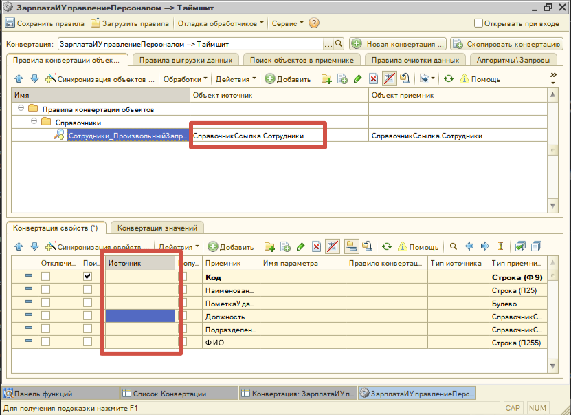
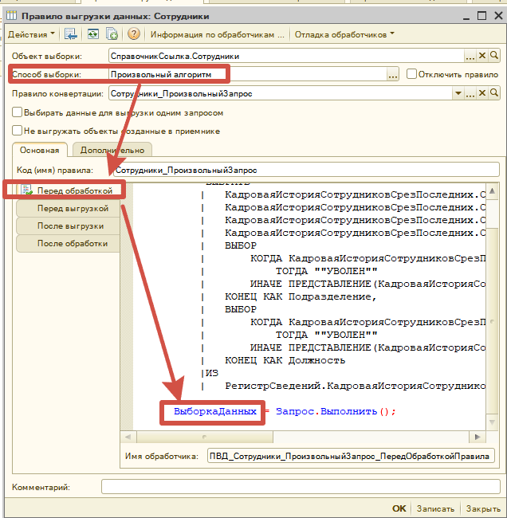

# Получение данных через произвольный запрос

## Создаем ПКО

1. Указываем **объект источник**, чтобы обработка при выгрузке данных по правилами моглас понять с чем мы работаем, с объектной сущностью или с набором записей.
2. Свойства не сопоставляем, все необходимые свойства будут выгружены из запроса в ПВД

## Создаем ПВД

| Поле                | Значение                                                                                 |
| ------------------- | ---------------------------------------------------------------------------------------- |
| Способ выбоки       | Произвольный алгоритм                                                                    |
| Обработчик          | Перед выборкой. Указываем запрос. Результат запрос передаем в переменную "ВыборкаДанных" |
| Правило конвертации | Указываем правило конвертации созданное на предыдущем шаге                               |

Важно понимать, что название полей в запросе, должно совпадать с названием поле в ПКС, иначе они не будут сопоставлены.

