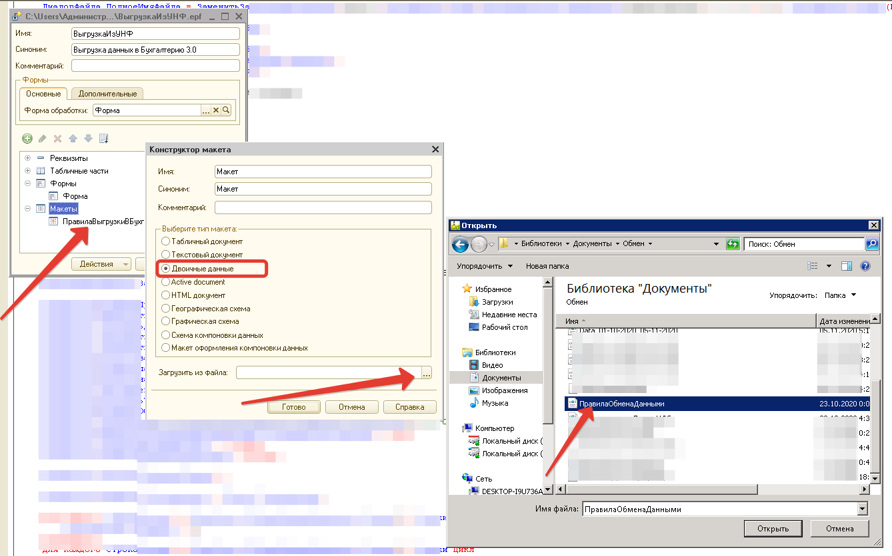
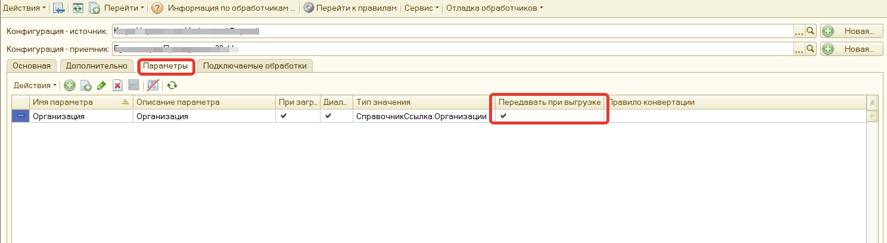
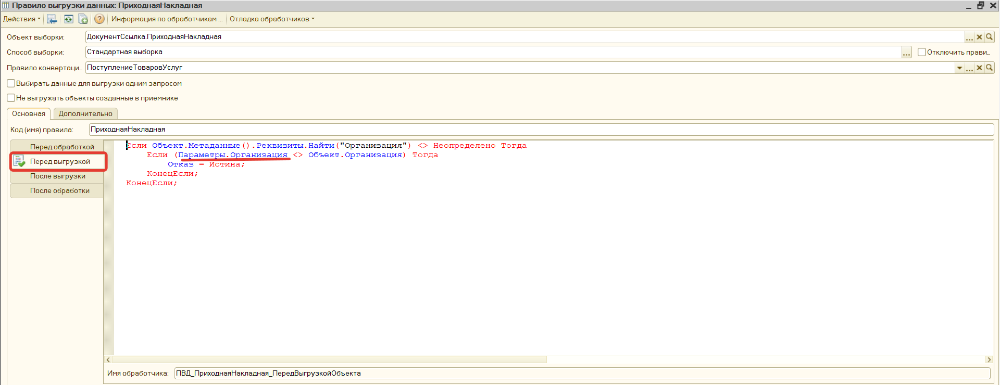
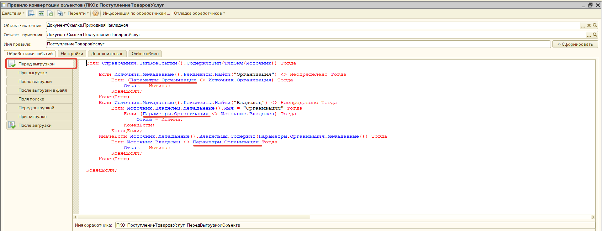
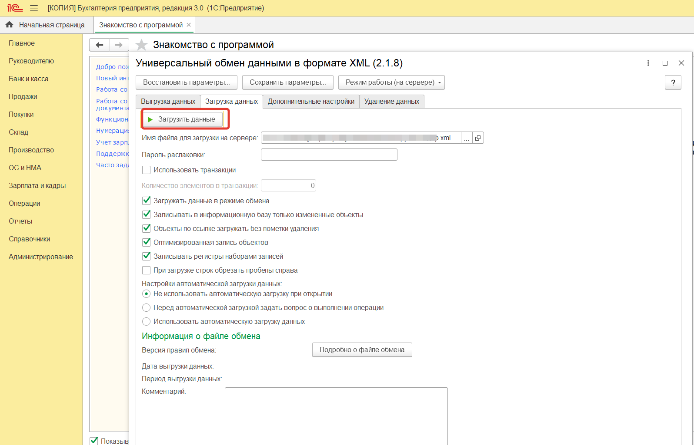

Обмен можно выполнять с абсолютно любой (в том числе и самописной) конфигурацией на базе 1С

# **1. Создание обработки и подключение макета с правилами** 

Создаем внешнюю обработку, добавляем к ней макет с типом двоичные данные, загружаем наши правила, разработанные в КД 2.0 в формате XML. Во вложениях к публикации есть примерные правила, которые можно использовать как заготовку.



## **2. Реализуем основную логику выгрузки данных**

Программный код для кнопки выгрузить данные:

```onec8
//Инициализируем обработку
Обработка = Обработки.УниверсальныйОбменДаннымиXMLОбмен.Создать();    
Обработка.РежимОбмена="Выгрузка";

//Указваем наши правила обмена    
ВремФайл = ПолучитьИмяВременногоФайла("xml");    
МакетПравилОбмена = РеквизитФормыВЗначение("Объект").ПолучитьМакет("ПравилаВыгрузкиВБухгалтерию");        
МакетПравилОбмена.Записать(ВремФайл);
Обработка.ИмяФайлаПравилОбмена = ВремФайл;

//Заполняем всякие разные параметры
Обработка.НеВыводитьНикакихИнформационныхСообщенийПользователю = Истина;
Обработка.ЗагружатьДанныеВРежимеОбмена = Истина;
Обработка.ЗаписыватьРегистрыНаборамиЗаписей = Истина;
Обработка.ЗапоминатьЗагруженныеОбъекты = Истина;
Обработка.ИспользоватьОтборПоДатеДляВсехОбъектов = Истина;
Обработка.ФлагКомментироватьОбработкуОбъектов = Истина;    
Обработка.ВыгружатьТолькоРазрешенные = Истина;      
Обработка.ТипУдаленияРегистрацииИзмененийДляУзловОбменаПослеВыгрузки=0;
// 0 - не снимать регистрацию, 1 - снимать регистрацию  
Обработка.НеВыводитьНикакихИнформационныхСообщенийПользователю = ложь;    
Обработка.ЭтоИнтерактивныйРежим     = Истина;
Обработка.ПараметрыИнициализированы = Истина;

//Указываем период выгрузки данных    
Обработка.ДатаНачала = ПериодВыгрузки.ДатаНачала;
Обработка.ДатаОкончания = ПериодВыгрузки.ДатаОкончания;

//Указываем выходной файл с данными
Обработка.ИмяФайлаОбмена = ИмяФайла;        
Обработка.ЗагрузитьПравилаОбмена();
```


# **3. Настраиваем отбор по организациям с использованием Конвертации данных 2.0**

Для того чтобы можно было использовать отбор по организации в обработке, нужно в правилах Конвертации данных 2.0 добавить параметр.



Далее этот параметр нужно задействовать в правилах выгрузки данных (ПВД) в событии **"Перед выгрузкой"** Например вот так:

```onec8
Если Объект.Метаданные().Реквизиты.Найти("Организация") <> Неопределено Тогда
    Если (Параметры.Организация <> Объект.Организация) Тогда
        Отказ = Истина;
    КонецЕсли;
КонецЕсли;
```



И в правилах конвертации объектов (ПКО) в событии **"Перед выгрузкой"**, например вот так:

```onec8
Если Справочники.ТипВсеСсылки().СодержитТип(ТипЗнч(Источник)) Тогда
    Если Источник.Метаданные().Реквизиты.Найти("Организация") <> Неопределено Тогда
        Если (Параметры.Организация <> Источник.Организация) Тогда
            Отказ = Истина;
        КонецЕсли;
    КонецЕсли;
    Если Источник.Метаданные().Реквизиты.Найти("Владелец") <> Неопределено Тогда
        Если Источник.Владелец.Метаданные().Имя = "Организации" Тогда
            Если (Параметры.Организация <> Источник.Владелец) Тогда
                Отказ = Истина;
            КонецЕсли;
        КонецЕсли;
    ИначеЕсли Источник.Метаданные().Владельцы.Содержит(Параметры.Организация.Метаданные()) Тогда 
        Если Источник.Владелец <> Параметры.Организация Тогда
            Отказ = Истина;
        КонецЕсли; 
    КонецЕсли;
КонецЕсли;
```



Для выгрузки данных с отбором по организации программно заполняем значение нашего параметра в обработке

```onec8
Обработка.Параметры.Организация = Объект.Организация;

Для каждого СтрокаТаблицыПараметров ИЗ Обработка.ТаблицаНастройкиПараметров Цикл
        Если СтрокаТаблицыПараметров.Имя = "Организация" Тогда 
            СтрокаТаблицыПараметров.Значение =     Объект.Организация;
        КонецЕсли;    
КонецЦикла;


//Отключим текущие правила, чтобы лишнего не выгружалось
//Обработка.ТаблицаПравилВыгрузки.Строки[0] - Справочники

Для Каждого СтрокаУровня Из Обработка.ТаблицаПравилВыгрузки.Строки[0].Строки Цикл  
        СтрокаУровня.Включить = 0; 
КонецЦикла;

//Обработка.ТаблицаПравилВыгрузки.Строки[1] - Документы
Для Каждого СтрокаУровня Из Обработка.ТаблицаПравилВыгрузки.Строки[1].Строки Цикл
        СтрокаУровня.Включить = 0; 
КонецЦикла;

//Определим список документов по которым нужно выгружать данные
СписокАктивныхОбъектовКВыгрузке = ОпределитьСписокАктивных();  
```

Реализуем дополнительную функцию для определения активных документов

```onec8
Функция ОпределитьСписокАктивных()
    СписокАктивныхОбъектовКВыгрузке = Новый СписокЗначений;
    СписокАктивныхОбъектовКВыгрузке.Добавить(?(Объект.ПриходнаяНакладная=Истина,"ПриходнаяНакладная",""));
    СписокАктивныхОбъектовКВыгрузке.Добавить(?(Объект.РасходнаяНакладная=Истина,"РасходнаяНакладная",""));
    СписокАктивныхОбъектовКВыгрузке.Добавить(?(Объект.СчетФактура=Истина,"СчетФактура",""));
    СписокАктивныхОбъектовКВыгрузке.Добавить(?(Объект.СчетФактураПолученный=Истина,"СчетФактураПолученный",""));
    СписокАктивныхОбъектовКВыгрузке.Добавить(?(Объект.СчетНаОплату=Истина,"СчетНаОплату",""));
    СписокАктивныхОбъектовКВыгрузке.Добавить(?(Объект.РасходИзКассы=Истина,"РасходИзКассы",""));
    СписокАктивныхОбъектовКВыгрузке.Добавить(?(Объект.ПоступлениеВКассу=Истина,"ПоступлениеВКассу",""));
    СписокАктивныхОбъектовКВыгрузке.Добавить(?(Объект.РасходСоСчета=Истина,"РасходСоСчета",""));
    СписокАктивныхОбъектовКВыгрузке.Добавить(?(Объект.ПоступлениеНаСчет=Истина,"ПоступлениеНаСчет",""));
    СписокАктивныхОбъектовКВыгрузке.Добавить(?(Объект.ОприходованиеЗапасов=Истина,"ОприходованиеЗапасов",""));
    СписокАктивныхОбъектовКВыгрузке.Добавить(?(Объект.СписаниеЗапасов=Истина,"СписаниеЗапасов",""));

    Возврат СписокАктивныхОбъектовКВыгрузке;    
КонецФункции
```

Реализуем заполнение настроек отбора по документам. Основная идея в том, чтобы заполнить для каждого ПВД настройки отбора с помощью построителя отчетов.

```onec8
Для Каждого ТекущееПВД Из Обработка.ТаблицаПравилВыгрузки.Строки[1].Строки Цикл
	
	НаименованиеОбъектаДляВыгрузки = ТекущееПВД.Имя;
	
	Если СписокАктивныхОбъектовКВыгрузке.НайтиПоЗначению(НаименованиеОбъектаДляВыгрузки) <> Неопределено Тогда
		
		Построитель = Новый ПостроительОтчета;
		Построитель.Текст = 
		"ВЫБРАТЬ Разрешенные Объект.Ссылка КАК Ссылка ИЗ Документ."
		+НаименованиеОбъектаДляВыгрузки+
		" КАК Объект {ГДЕ Объект.Ссылка.* КАК Документ_"
		+НаименованиеОбъектаДляВыгрузки+
		"}";
		
		Построитель.ЗаполнитьНастройки();
		Построитель.Отбор.Добавить("Документ_"+НаименованиеОбъектаДляВыгрузки+".Ссылка");
		
		Построитель.Отбор[0].ВидСравнения = ВидСравнения.ВСписке;
		Построитель.Отбор[0].Значение = ОпределитьСписокСсылокПоТипуДокумента(НаименованиеОбъектаДляВыгрузки);
		Построитель.Отбор[0].Использование = Истина;
		
		ДоступностьПостроителя = Истина;
		
		Если Построитель.Отбор.Количество() > 0 Тогда
			
			ТекущееПВД.Включить = 1;
			ТекущееПВД.НастройкиПостроителя = Построитель.ПолучитьНастройки();
			ТекущееПВД.ИспользоватьОтбор    = ИСТИНА;
			
		КонецЕсли;
		
	КонецЕсли;
	
КонецЦикла;
```

Обходим табличную часть "Список документов" на форме, для формирования списка документов к выгрузке

```onec7
Функция ОпределитьСписокСсылокПоТипуДокумента(ТипДокумента)
    СписокДок = Новый СписокЗначений;    
    Для каждого Стр Из СписокДокументов Цикл
        Если не Стр.Метка Тогда
            продолжить;
        КонецЕсли;
        ТекОб = Стр.Ссылка.ПолучитьОбъект(); 
        ТипДокументаПоСсылке = ТекОб.Метаданные().имя;
        Если ТипДокументаПоСсылке = ТипДокумента Тогда 
            СписокДок.Добавить(Стр.Ссылка);
        КонецЕсли;
    КонецЦикла;        
    Возврат СписокДок;    
КонецФункции
```

Непосредственно выгрузка.

```onec8
Обработка.ВыполнитьВыгрузку();
Обработка = Неопределено;    
```

Для удобства пользователя можно реализовать универсальную процедуру для заполнения списка документов с отбором по организации и периоду при переключения флажков на форме. 

```onec8
&НаСервере
Процедура ОбновитьСписокДокументовНаСервереСкладской(ТипДокумента)
    Н = "";
    
    Запрос = Новый запрос();
    Запрос.Текст = "ВЫБРАТЬ " + Н + "
    |    "+ТипДокумента+".ссылка,
    |    "+ТипДокумента+".Организация
    
    |ИЗ
    |    Документ."+ТипДокумента+" КАК "+ТипДокумента+"
    |ГДЕ
    |    "+ТипДокумента+".Дата МЕЖДУ &Начало И &Конец
    |  И "+ТипДокумента+".Организация = &Организация
    |  И "+ТипДокумента+".Проведен" ;
        
    Запрос.УстановитьПараметр("Начало",  ПериодВыгрузки.ДатаНачала);
    Запрос.УстановитьПараметр("Конец",  ПериодВыгрузки.ДатаОкончания);
    Запрос.УстановитьПараметр("Организация",  Объект.Организация);
    
    Результат = Запрос.Выполнить().Выбрать();
    Пока Результат.Следующий() Цикл
         НовСтрока = СписокДокументов.Добавить();
         НовСтрока.Метка = Истина;
         НовСтрока.ссылка =  Результат.Ссылка;
         НовСтрока.Организация =  Результат.Организация;
    КонецЦикла;    

КонецПроцедуры
```

После выгрузки данных полученный XML файл можно легко загрузить обработкой "Универсальный обмен данными в формате XML"  в конфигурации-приемнике.



При желании данный обмен можно реализовать в регламентом задании.

Проверено на УНФ 1.4.1.19 - Бухгалтерия 3.0.81.30.